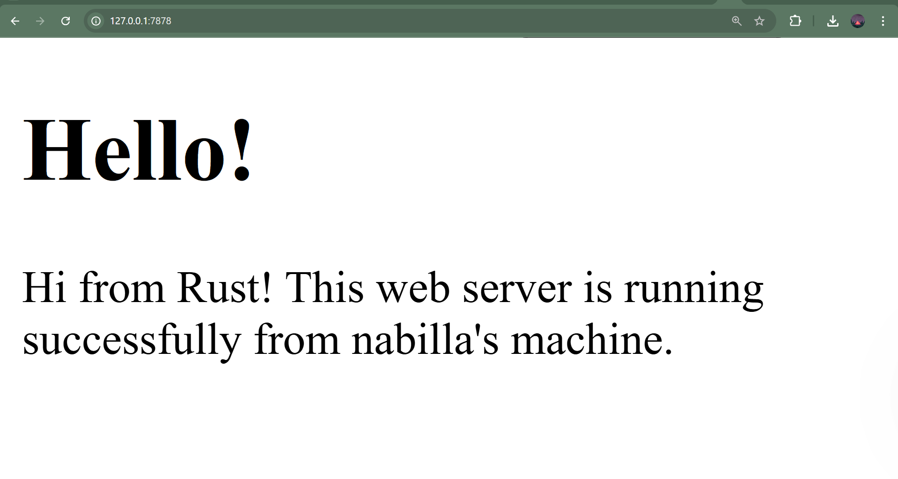

# Tutorial 6 - Rust Web Server

## Commit 1 Reflection Notes

Pada commit ini, saya mempelajari cara membuat single-threaded web server
menggunakan Rust. Fungsi `handle_connection` menerima parameter `TcpStream`
yang merepresentasikan koneksi dari browser ke server.

`BufReader` digunakan untuk membaca data dari stream secara efisien dengan
buffering. Method `.lines()` menghasilkan iterator yang membaca request HTTP
baris per baris. Method `.take_while(|line| !line.is_empty())` digunakan untuk
mengambil baris hingga menemukan baris kosong, karena dalam protokol HTTP,
header dipisahkan dari body oleh baris kosong.

Hasil `collect()` mengumpulkan semua baris menjadi sebuah `Vec<String>` yang
merepresentasikan HTTP request headers. Ketika browser mengakses
`127.0.0.1:7878`, server mencetak seluruh HTTP request headers ke console,
yang memperlihatkan method GET, path, dan informasi browser.

## Commit 2 Reflection Notes

Pada commit ini, server sekarang dapat mengembalikan konten HTML ke browser.
Fungsi `fs::read_to_string("hello.html")` digunakan untuk membaca file HTML
dari filesystem dan mengubahnya menjadi String.

Response HTTP yang valid harus memiliki format: status line, diikuti headers,
diikuti baris kosong, diikuti body. Header `Content-Length` wajib disertakan
agar browser tahu panjang konten yang dikirim. Method `stream.write_all()`
digunakan untuk mengirimkan byte response ke browser melalui TCP stream.

`format!` macro digunakan untuk membuat string response dengan interpolasi
variabel. `\r\n` adalah CRLF (Carriage Return Line Feed) yang merupakan
standar line ending dalam protokol HTTP sesuai RFC 7230.

