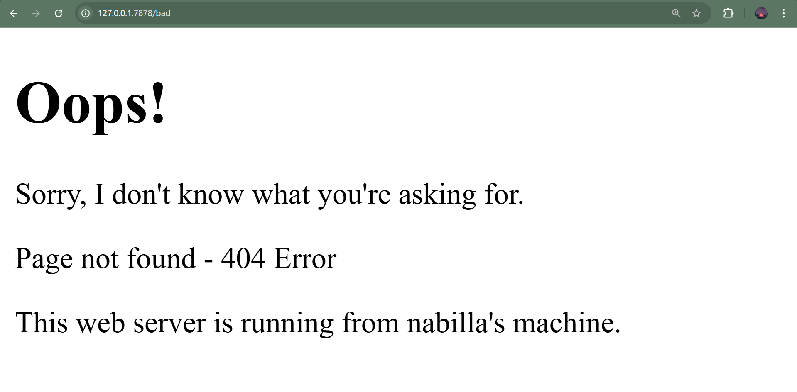

# Tutorial 6 - Rust Web Server

## Commit 1 Reflection Notes

Pada commit ini, saya mempelajari cara membuat single-threaded web server
menggunakan Rust. Fungsi `handle_connection` menerima parameter `TcpStream`
yang merepresentasikan koneksi dari browser ke server.

`BufReader` digunakan untuk membaca data dari stream secara efisien dengan
buffering. Method `.lines()` menghasilkan iterator yang membaca request HTTP
baris per baris. Method `.take_while(|line| !line.is_empty())` digunakan untuk
mengambil baris hingga menemukan baris kosong, karena dalam protokol HTTP,
header dipisahkan dari body oleh baris kosong.

Hasil `collect()` mengumpulkan semua baris menjadi sebuah `Vec<String>` yang
merepresentasikan HTTP request headers. Ketika browser mengakses
`127.0.0.1:7878`, server mencetak seluruh HTTP request headers ke console,
yang memperlihatkan method GET, path, dan informasi browser.

## Commit 2 Reflection Notes

Pada commit ini, server sekarang dapat mengembalikan konten HTML ke browser.
Fungsi `fs::read_to_string("hello.html")` digunakan untuk membaca file HTML
dari filesystem dan mengubahnya menjadi String.

Response HTTP yang valid harus memiliki format: status line, diikuti headers,
diikuti baris kosong, diikuti body. Header `Content-Length` wajib disertakan
agar browser tahu panjang konten yang dikirim. Method `stream.write_all()`
digunakan untuk mengirimkan byte response ke browser melalui TCP stream.

`format!` macro digunakan untuk membuat string response dengan interpolasi
variabel. `\r\n` adalah CRLF (Carriage Return Line Feed) yang merupakan
standar line ending dalam protokol HTTP sesuai RFC 7230.

## Commit 3 Reflection Notes

Pada commit ini, server sekarang dapat melakukan validasi request dan
memberikan response yang berbeda tergantung path yang diminta. Hanya request
`GET / HTTP/1.1` yang akan mendapatkan response 200 OK dengan halaman
`hello.html`.

Refactoring dilakukan dengan menggunakan tuple destructuring `let (status_line,
filename) = if ... else ...` untuk menghindari duplikasi kode. Sebelumnya,
kedua blok if dan else masing-masing membaca file dan menulis response secara
terpisah. Setelah refactoring, perbedaan antara kedua kasus (status line dan
nama file) dipisahkan ke dalam if-else, sementara logika membaca file dan
menulis response hanya ditulis sekali. Ini membuat kode lebih maintainable
karena perubahan pada logika response cukup dilakukan di satu tempat.

Request ke path lain seperti `/bad` atau `/sleep` akan mendapatkan response
404 NOT FOUND dengan halaman `404.html`.

## Commit 4 Reflection Notes

Pada commit ini, saya mensimulasikan slow request dengan menambahkan endpoint
`/sleep` yang akan membuat server tidur selama 10 detik sebelum merespons.

Ketika membuka dua tab browser, satu ke `/sleep` dan satu ke `/`, terlihat
bahwa request ke `/` harus menunggu hingga request `/sleep` selesai. Ini
membuktikan kelemahan single-threaded server: server hanya bisa menangani
satu request pada satu waktu secara berurutan (sequential).

Jika banyak user mengakses server secara bersamaan dan ada satu request yang
lambat, semua request lainnya akan ter-block dan harus mengantri. Ini adalah
masalah yang disebut "head-of-line blocking". Solusinya adalah menggunakan
multi-threading agar setiap request dapat diproses secara independen oleh
thread yang berbeda, sehingga slow request tidak memblokir request lainnya.
